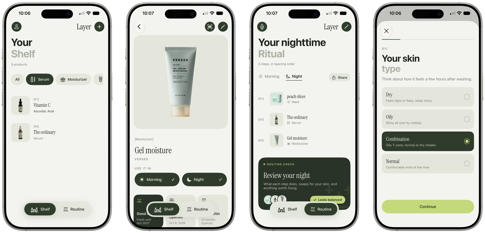

<p align="center">
  
</p>

<h1 align="center">Layer</h1>

<p align="center"><b>Ingredient-smart skincare for iOS.</b><br/>
Scan a label, understand what's inside, and build a morning and night routine that works for your skin.</p>

<p align="center">
  SwiftUI · SwiftData · Vision · Foundation Models · SpeechAnalyzer · WidgetKit · iOS 26
</p>

<p align="center">
  
</p>

---

## Why

Skincare labels are dense INCI lists in tiny type. Most people can't tell which of their products clash, what order to apply them in, or whether that serum from last spring is still good. Layer reads the bottle for you and turns it into something you can act on.

Under the hood it's three problems I care about: **pulling structured data out of messy real-world documents**, **an assistant that reasons over your own data**, and **voice as an input**. All of it runs on the phone.

## What it does

| | |
|---|---|
| **Scan any label** | Photograph a bottle, tube or box (2 or 3 angles if the list wraps). Layer reads the ingredient list, product name, brand, type and shelf life. |
| **Find the product photo** | Barcode lookup, then visual search, then a strict name match. The product is lifted off its background on device, so every photo is a clean transparent cutout. |
| **Know what's inside** | Each ingredient is matched to a 242-entry database with roles, plain-English summaries and tags. Unknown ones are classified by INCI naming rules and learned for next time. |
| **Fit your skin** | A 5-question profile (type, sensitivity, concerns, experience with actives, things to avoid) drives personal flags like "good for breakouts" or "has fragrance, which you wanted to avoid". |
| **Layer it right** | Pick products for morning and night. Layer orders them thinnest to thickest and flags clashes, like retinol with acids, from 11 conflict rules. |
| **Routine review** | An assistant explains each step, suggests swaps and gaps, and answers questions about your routine with tool calls into your shelf. |
| **Voice check-ins** | "Used the retinol, skin feels tight" becomes a structured log of products, skin feel and reactions. |
| **Expiry tracking** | Uses the open-jar symbol from the label, or the typical shelf life for that product type. Warns before something turns. |
| **Widget and sharing** | Tonight's routine on your home screen and lock screen. Share a routine as a styled card or a plain list. |

## How scanning works

```
photo(s) ──► Vision OCR ──┬──► INCI parser ──► ingredient DB + classifier ──┐
   │                      │                                                ├──► review ──► shelf
   │                      └──► rules + on-device LLM ──────────────────────┘
   │                           (name, brand, type, PAO, % actives)
   └──► barcode ──► Open Beauty Facts / UPCitemdb ──► Google Lens ──► subject cutout ──► product photo
```

- **Ingredients never touch the LLM.** A deterministic parser splits the INCI list (handling `1,2-Hexanediol`, `Water (Aqua)`, words broken across lines, and lists spread over several photos), then matches each name with alias and typo-tolerant lookup. A model can't invent an ingredient that isn't on the bottle.
- **The model handles the fuzzy parts.** Name, brand and category come from `@Generable` guided generation, so the output is typed Swift, not JSON to parse.
- **Rules first, model second.** Regex and heuristics run every time and are the full fallback on devices without Apple Intelligence. The app is complete without it.
- **Human in the loop.** Nothing is saved until you've reviewed and edited it.

## The assistant

The routine assistant is a `LanguageModelSession` with three tools: the current routine, rule-based suggestions, and your whole shelf. It answers from your data instead of from general knowledge. On devices without Apple Intelligence, `RoutineAdvisor` produces the same review (step explanations, swaps, gaps, one-tap fixes) from rules, so the feature never disappears.

## Privacy and cost

- Your shelf, profile and check-ins live in SwiftData on the phone. No account, no backend.
- OCR, extraction, speech, background removal and the assistant run on device.
- Network calls are only for finding a product photo, and every source is free with no card: Open Beauty Facts, the UPCitemdb trial endpoint, and an optional SerpApi key (free tier) for Google Lens.

## Design

A small design system in `Design/Theme.swift`: sage-white pages, sage cards, dark green controls, forest feature tiles and one loud lime for calls to action. Product names are set in Instrument Serif, section titles in a bold two-tone sans, with `[bracket]` labels and numbered rows. Icons are a custom line set drawn as template SVGs. Everything adapts to dark mode.

## Project structure

```
Layer/
├─ Scanning/        OCR, INCI parser, heuristics, LLM extraction, barcode, photo search, cutouts
├─ Ingredients/     ingredient database, classifier, conflict rules (JSON)
├─ Profile/         skin profile, onboarding and intro tour, personal fit checks
├─ Routine/         routine tab, ordering, conflict checker, editor, share card
├─ Assistant/       Foundation Models session + tools, rule-based advisor
├─ Voice/           SpeechAnalyzer recorder, check-in parser
├─ Views/           shelf, product page, add and review flows
├─ Models/          SwiftData models (Product, RoutineLog)
├─ WidgetSupport/   snapshot shared with the widget through an App Group
└─ Design/          colors, type, buttons, shared components
LayerWidget/        small, medium and lock screen widgets
LayerTests/         Swift Testing suites
```

## Run it

**Requirements:** Xcode 26+, iOS 26+. A real iPhone is best since the camera and speech need hardware. Apple Intelligence is optional.

1. Clone and open `Layer/Layer.xcodeproj`.
2. In **Signing & Capabilities**, pick your team for both the **Layer** and **LayerWidgetExtension** targets.
3. Both targets use the App Group `group.com.ritikajoshi.layer`. If you change the bundle ID, change the group in both targets and in `WidgetSync.swift` / `LayerWidget.swift`.
4. Optional, for Google Lens photo search: create `Layer/Layer/Secrets.plist` with your free [SerpApi](https://serpapi.com) key. It's gitignored.

   ```xml
   <?xml version="1.0" encoding="UTF-8"?>
   <!DOCTYPE plist PUBLIC "-//Apple//DTD PLIST 1.0//EN" "http://www.apple.com/DTDs/PropertyList-1.0.dtd">
   <plist version="1.0"><dict>
     <key>SerpApiKey</key><string>YOUR_KEY</string>
   </dict></plist>
   ```

5. Run on your iPhone. On first launch you get a short tour, then the skin questions.

## Tests

`Cmd+U` runs the Swift Testing suites: INCI parsing, ingredient classification, conflict rules, fit checks, check-in parsing and the routine advisor. These cover the deterministic core that everything else leans on.

## Roadmap

- [x] Label scanning with multi-photo merge, ingredient database, shelf
- [x] Learned ingredients and INCI-based classifier for unknowns
- [x] Product photo search with on-device background removal
- [x] Skin profile, personal fit checks, intro tour
- [x] Routine builder with layering order and conflict checks
- [x] Routine assistant with tool calling, plus a rule-based fallback
- [x] Voice check-ins with SpeechAnalyzer
- [x] Expiry tracking
- [x] Home screen and lock screen widget, routine sharing
- [ ] App Intents and Siri ("what's my routine tonight?")
- [ ] Trends from check-ins over time

## Credits

- [Instrument Serif](https://fonts.google.com/specimen/Instrument+Serif) under the SIL Open Font License
- Product data from [Open Beauty Facts](https://world.openbeautyfacts.org) (ODbL) and [UPCitemdb](https://www.upcitemdb.com)

> Layer gives ingredient information, not medical advice. Patch test new products and see a dermatologist for skin concerns.
